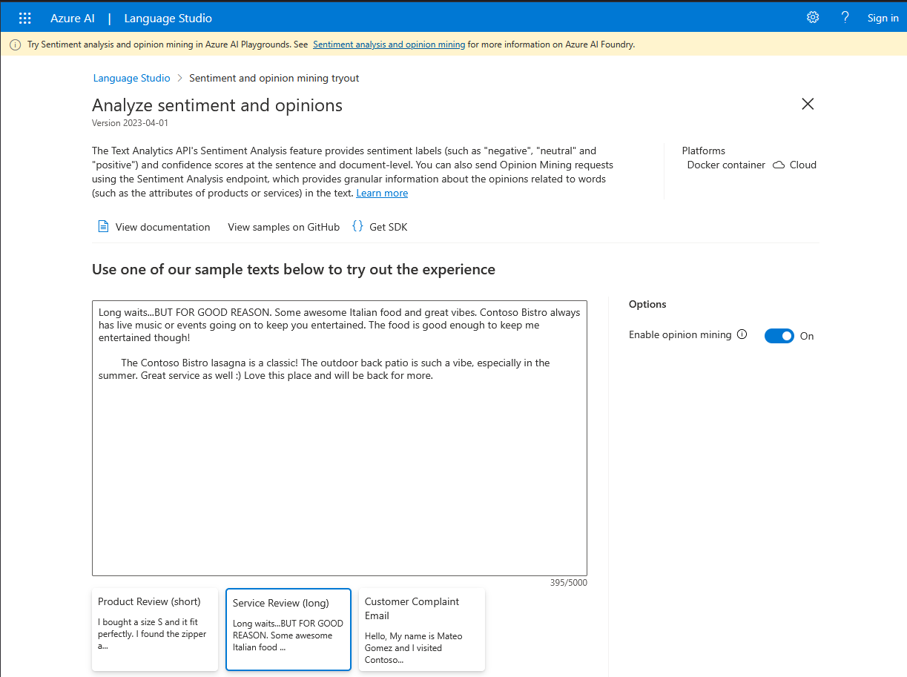
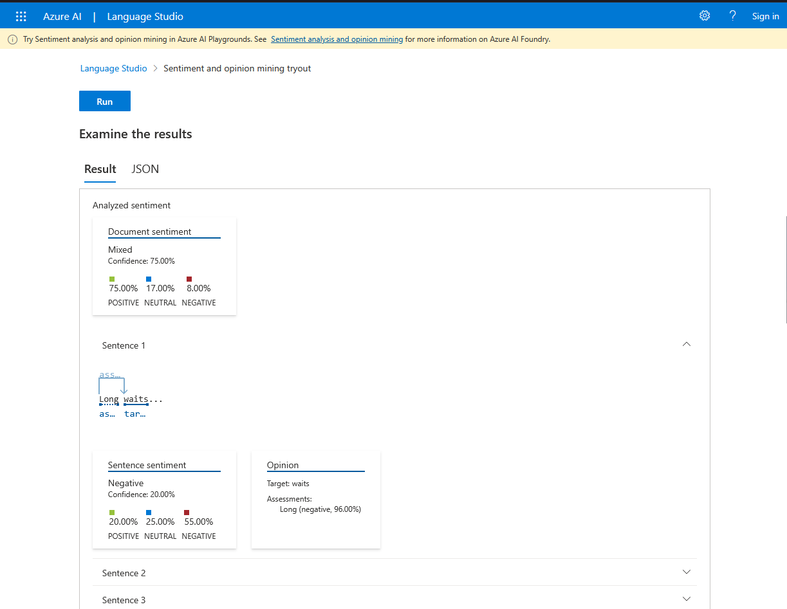

# Explorar o Language Studio

O serviço Azure AI Language permite que você crie aplicativos que
entendam o significado e o contexto do texto. Você pode usar o AI
Language para criar um aplicativo que analise o sentimento de avaliações de produtos ou extraia frases-chave de documentos, além de outras funções.

Neste exercício, você usará a Galeria de Serviço de voz do Language
Studio.

## Testar o recurso de analisar sentimentos e extrair opiniões.

1. No navegador de sua preferência, abra o [Azure AI \| Language
    Studio](https://language.cognitive.azure.com/).

2. Escolha a opção ***Classify text*** e nas opções que aparecem, selecione ***Try it out*** de ***Analyze sentiment and mine opinions***.

3. Na tela que abriu digite o texto desejado ou selecione um dos exemplos disponíveis.

4. Clique em ***Run*** e veja os resultados.

Neste exercício testamos o recurso de analisar sentimentos e extrair opiniões.
