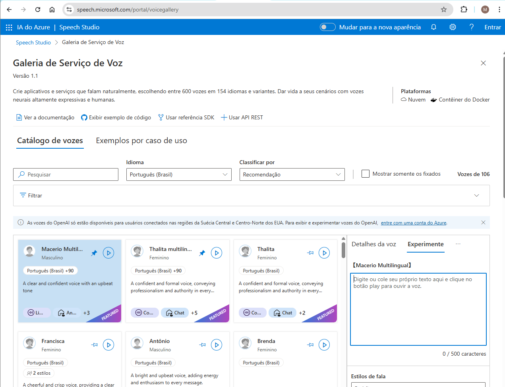
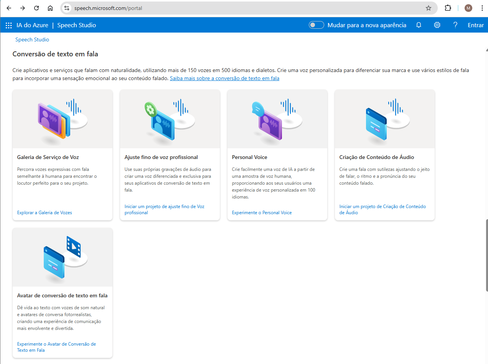

# Explorar o Speech Studio

O serviço Azure AI Speech transcreve fala em texto e texto em fala
audível. Você pode usar o AI Speech para criar um aplicativo que
transcreva notas de reuniões ou gere texto a partir da gravação de
entrevistas.

Neste exercício, você usará a Galeria de Serviço de voz do Speech
Studio.

## Testar o recurso de conversão de texto em fala.

1. No navegador de sua preferência, abra o [IA do Azure \| Speech
    Studio](https://speech.microsoft.com/portal).

2. Navegue para baixo, até encontrar as opções de ***Conversão de texto em fala***.

3. Selecione a opção [Explorar a Galeria de
    Vozes](https://speech.microsoft.com/portal/voicegallery).

4. Na tela que abriu escolha uma voz no catálogo de vozes
    disponibilizados.

5. No lado direito, escolha a opção Experimente e digite um texto para
    testar.

Neste exercício testamos o recurso de conversão de texto para fala.
